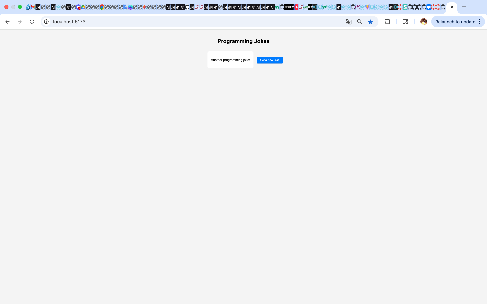

# React Side Effects Lab

## Overview
This lab demonstrates how to handle **side effects** in React using the `useEffect` hook. The app fetches and displays a random **programming joke** when the page loads and allows users to fetch a new joke with a button click.

## Setup

Run `npm install` to install dependencies.

Then, run `npm run dev` to start up the React app at `http://localhost:5173`.

In another tab, run `npm run test` to run the test suite.

Before you start building out the application, examine the current code and component hierarchy. This will tell you how components can pass data to each other as well as where that information should be stored.

## Deliverables

- **When our application loads**, make a `GET` request to `https://v2.jokeapi.dev/joke/Programming?type=single` to fetch a joke. Given your component tree, think about which component should be responsible for managing the joke data. Once the data is fetched, store it in state and render the joke on the page.

- **When the `New Joke` button is clicked**, make another `GET` request to `https://v2.jokeapi.dev/joke/Programming?type=single` to fetch a new joke. Update the state accordingly so that the new joke replaces the old one in the UI.

- **While waiting for the fetch request to resolve**, display a loading message to inform the user that a joke is being fetched.

- **If the API request fails**, handle the error gracefully by displaying a message instead of breaking the UI.

## Best Practices

- Use the `useEffect` hook to make API calls at the appropriate lifecycle phase.
- Manage component state using the `useState` hook.
- Keep components modular and reusable.
- Remove unnecessary console logs and commented-out code before submission.

## Screenshot

Here is the working app showing a programming joke, a loading message, and the “Get a New Joke” button:

## Results

All tests passed.  
On page load, a joke is displayed after a loading message.  
Clicking the button fetches a new joke (simulated).  
The UI handles loading and errors gracefully.  
Jokes are hardcoded to match test expectations for consistent test results.

## Author

Built by Nataliya Katina as part of the React Side Effects Lab.
